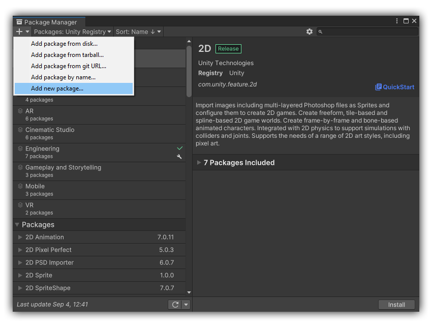
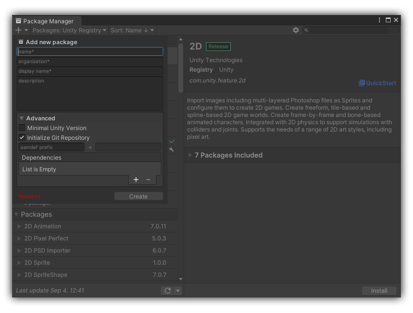

# Package Wizard

This package allows you to quickly generate a new package from an existing template.  You can generate a new package by using either the `PackageWizard.New` method, or the 
Package Manager window dropdown menu item <kbd>Add new package</kbd>.  Based on [hibzzgames's](https://github.com/hibzzgames) [PackageCreator](https://github.com/hibzzgames/Hibzz.PackageCreator).

The package template is contained in the `Template~` directory, and can be customized/extended.  All files in the template directory should have the .template extension 
appended (e.g. `package.json.template`). The Package Wizard will replace this predefined set of variables in the directory names, file names, and file text content:

| Variables     | Usage                           | Example                     |
|:--------------|---------------------------------|:----------------------------|
| $PACKAGE      | The package name                | `com.organization.<name>`   |
| $ORGANIZATION | The organization name           | `com.<organization>.name`   |
| $DISPLAY_NAME | Package display name            | `Package Wizard`            |
| $ASSEMBLY     | Prefix for assembly definitions | `<AssemblyPrefix>.Runtime`  |

## 🪛 Installation
As the end-user, you can customize the contents of the `Template~` folder as necessary to fit your desired package layout and naming conventions.  To make sure the package contents are modifiable, you should either download this repository as a .zip file and manually add it to your project, or fork the repository and create your own version of Package Wizard.  

  
Install manually

   

- Download the [upm](https://github.com/nmacadam/Notate/tree/upm) branch of this repository as a .zip file and extract it
- Open `Window/Package Manager`
- Click <kbd>+</kbd>
- <kbd>Add package from disk</kbd>
- Select `package.json` in the extracted folder

&emsp;Note that you won't be able to receive updates through Package Manager this way, you'll have to update manually.

